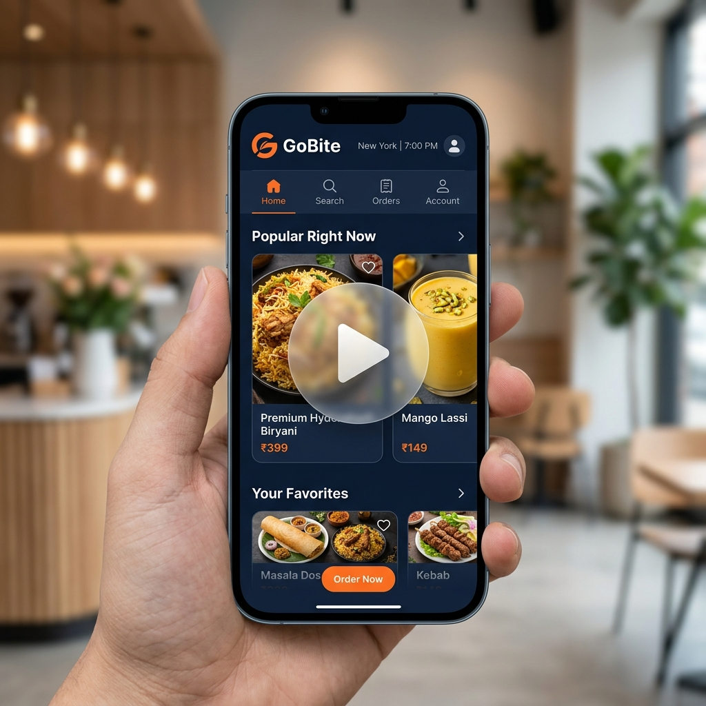

# 🚀 GoBite — Multi-Role On-Demand Delivery & Order Ecosystem

[](https://flutter.dev)
[](https://dart.dev)
[](#)
[](#)
[](#)
[](#)

GoBite is a high-performance, real-time, multi-role on-demand delivery platform built with **Flutter**, **Dart**, and **WebSockets**. The ecosystem seamlessly connects **Customers**, **Restaurants/Shops**, and **Riders** under a centralized, real-time message-brokering backend server. 

Whether ordering local delicacies, daily groceries, snacks, or medicine, GoBite provides an immersive, instantaneous experience with real-time tracking, transparent feedback, and lightning-fast state synchronization.

---

## 🎬 Video Demonstration

See the complete GoBite platform in action! Click the interactive video banner below to watch the system demo, showing live order sync, real-time tracking, and dashboard updates.

<div align="center">
  <a href="https://drive.google.com/file/d/1SEkNaNxRkrAXSFBco2NpYrwra0sJ2rdq/view?usp=sharing" target="_blank">
    
  </a>
  <br />
  <br />
  <p><strong>👆 Click the image above to watch the GoBite System Demonstration Video on Google Drive</strong></p>
</div>

---

## 📱 Ecosystem Components

The GoBite platform is divided into four main pillars, each engineered for a distinct role in the delivery chain:

### 1. 📱 GoBite Customer App
The consumer-facing portal designed with focus on usability and seamless transitions:
* **Multi-Category Catalog**: Browse through curated items under **Food**, **Drinks**, **Snacks**, **Medicine**, and **Others/Groceries**.
* **Smooth Cart & Notifications**: Access active carts and event notifications via clean bottom sheets that support intuitive swipe gestures or a direct close button interface.
* **Live Rider Tracking**: Track the designated rider's real-time position on an interactive map as they pick up and transport orders.
* **Review & Rating System**: Rate ordered items directly, with reviews immediately broadcasted and saved to the ecosystem.

### 2. 🏪 GoBite Restaurant Portal
The dashboard for merchants to orchestrate incoming orders and manage products:
* **Real-time Order Queue**: Instantly view incoming orders with details on items, quantities, and customer specifications.
* **Product Catalog Builder**: Add new products dynamically, upload product images (automatically stored via base64 upload APIs on the server), and set pricing.
* **Live Review Feed**: Monitor customer feedback, review scores, and written comments as they are posted in real-time.

### 3. 🚴 GoBite Rider App
The interface for delivery agents to receive, route, and fulfill jobs:
* **Instant Delivery Bids**: Receive real-time requests for orders ready for pickup.
* **Live GPS Broadcast**: Seamlessly stream GPS coordinates to the server using Geolocator and WebSocket channels.
* **Fulfillment Flow**: Multi-step status progression (Order Picked Up $\rightarrow$ Out for Delivery $\rightarrow$ Order Delivered).

### 4. 🖥️ GoBite Smart Server
The real-time backbone of the entire ecosystem:
* **WebSocket Message Broker**: Routes events, updates, and location coordinates instantly between customers, riders, and restaurants.
* **HTTP Auth & Uploads API**: Handles signup, signin, and serves as an image hosting platform converting base64 streams into accessible URLs.
* **JSON Database Engines**: Fully persistent storage utilizing flat JSON files (`users.json`, `restaurants.json`, `riders.json`, `orders.json`, and `products.json`) to retain active states, reviews, and historical records across restarts.

---

## ⚡ Key Features

* **Bi-directional WebSockets Connection**: Sub-second synchronization of order states without polling overhead.
* **Dynamic Notifications**: Automatically notifies customer apps when restaurants add new items to the catalog or update order progress.
* **Persistent Orders**: Complete recovery of orders, user authentication, and profile statuses upon app restart or server reload.
* **Real-time Map Integration**: Uses OpenStreetMap/Google Maps to render interactive rider paths, starting coordinates, and delivery destinations.

---

## 🛠️ Technical Stack

### Frontend (Apps)
* **Framework**: Flutter (Dart SDK)
* **State Management**: BLoC Pattern (`flutter_bloc`)
* **Real-time Networking**: `web_socket_channel` & `http`
* **Maps & Geo-location**: `flutter_map`, `latlong2`, `google_maps_flutter`, and `geolocator`
* **Local Caching**: `shared_preferences`

### Backend (Server)
* **Runtime**: Pure Dart SDK (`dart:io`, `dart:convert`)
* **Communication**: Native Dart `HttpServer` binding WebSocket connections
* **Data Persistence**: JSON-based flat files with file system locks
* **Image Processor**: Base64 decoding, storage, and static serving pipelines

---

## 🚀 Getting Started

Follow these instructions to set up and run the entire GoBite ecosystem locally.

### Prerequisites
* [Flutter SDK](https://docs.flutter.dev/get-started/install) (v3.11.0 or higher recommended)
* [Dart SDK](https://dart.dev/get-started/sdk)
* A mobile device or emulator

---

### Step 1: Start the Backend Server
First, run the Dart WebSocket & HTTP server. This acts as the central router.

```bash
# Navigate to the server directory
cd server

# Run the server
dart server.dart
```

You should see output indicating the server is running:
```text
🚀 GoBite Smart Server running on port 8080
   ├── Customer App:    ws://localhost:8080
   ├── Restaurant App:  ws://localhost:8080
   └── Rider App:       ws://localhost:8080
👤 Loaded users, restaurants, riders, and orders ...
```

---

### Step 2: Configure Server Host IP (Optional)
If running on a **physical device** or a **different machine**, update the backend server URL inside each client app:
* Locate the server configuration file or endpoint variable in the apps.
* Replace `localhost` or `127.0.0.1` with your machine's **Local Network IP address** (e.g., `192.168.1.100`).
* Ensure your firewall allows incoming traffic on port `8080`.

---

### Step 3: Run the Applications
Open separate terminal windows or run configurations inside your IDE to launch each client application:

#### GoBite Customer App
```bash
# From the root go_bite directory
flutter pub get
flutter run
```

#### GoBite Restaurant App
```bash
# From the go_bite_restaurant directory
flutter pub get
flutter run
```

#### GoBite Rider App
```bash
# From the go_bite_rider directory
flutter pub get
flutter run
```

---

## 📁 Project Structure (GoBite Root)

```text
go_bite/
├── assets/                  # Onboarding assets, logo, and video demo previews
│   └── images/
│       └── gobite_demo_preview.png
├── lib/
│   ├── core/                # App-wide configurations, constants, themes
│   ├── features/
│   │   ├── auth/            # Sign In/Up implementation
│   │   ├── customer/        # Customer screens, dashboard, tracking, reviews
│   │   └── entry/           # App onboarding workflows
│   └── shared/              # Models, widgets, and state blocks shared across apps
├── server/                  # Dart Server codebase
│   ├── server.dart          # Server implementation
│   ├── products.json        # Main product catalog database
│   ├── orders.json          # Persistent order history
│   └── uploads/             # Stores uploaded base64 merchant photos
└── pubspec.yaml             # Flutter dependency configuration
```

---

## 📄 License
This project is licensed under the MIT License - see the LICENSE file for details.
